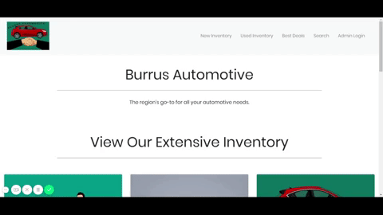

# car-dealership-app
Dynamic web project that monitors inventory of new & used cars.

For running this project :

1.Install Eclipse

2.Go to this path : File -> İmport -> Git -> Projects From Git ->  Clone URI

3.In the URI section copy and paste this: https://github.com/Charmaine-Burrus/car-dealership-app

4.Fill the user and password blanks with the username and password of your Github account.

5.Next the scrrens and finish the import project.

6.Skip the screen and finish the import project.

7.Save the Dealership files to your documents folder. 

8.Change the path field in Dealership class to match your local file path. 

9.Go this path : Right click of the project -> New -> Other -> Server -> Tomcat v8.5 server and create this server.

10.Take the content of server.xml and context.xml in the ServerConfings folder and replace with Servers'.

11.Run the project with using the Tomcat v8.5 server.

12.For better viewing, copy & paste the URL into your preferred web browser.

## Screenshots
#### Menu Screen

