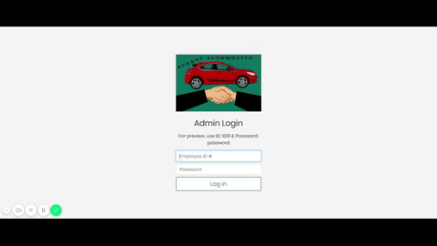

# car-dealership-app
Dynamic web project that monitors inventory of new & used cars.
Uses object-oriented principles such as inheritance. Designed with Java, HTML(JSP), JSTL, CSS, & servlets.

## Take a Look!
#### Home Screen

Details: Nav Bar Header for easy navigation to important pages. Cards with pictures to draw attention to desired pages and buttons to navigate there. Social Media quick links. Contact Info Footer.

#### Inventory Screens

Details: For New Vehicles and Used Vehicle pages, cards display each vehicle in that specific inventory with picture and details. Option to place a bid on the vehicle is displayed only if that vehicle has been in inventory for 120+ days from current date. 
For Best Deals page, cards display info for vehicles which have been in their inventory for 120+ days and thus are eligible for bid at a 90% discount rate. 

#### Placing a Bid

Features: Place bid page displays all details of the car and includes a form for user input. If the user enters a bid which is lower than 90% of the asking price, a warning will be displayed that the bid is too low. This prompts user to try another bid. If the bid is accepted, the car is removed from inventory and user is directed to details for finalizing the purchase and picking up the car.

#### Searching for a Particular Vehicle

Details: User can search for a particular car by model and new or used. Only models currently in the inventory will be displayed for users to choose from. All results will be returned to user as cards for view (with option to bid if 120+ days). If a user selects a model and new/used combo that is not available in the inventory, they will be notified and asked to try another search.

#### Admin Login & Admin Home

Details: User login credentials are checked against records of current employees. If the creditials are correct, the user is directed to Admin Home where they can view a chart of sales for the month (updated monthly by staff) and Sales Report which displays all cars sold to date (info is updated each time a customer places a successful bid).

#### Mobile View

Details: Responsive web design ensures that this app will display well on phone, tablet, and desktop screens. Designed to give a fantastic user experience!

## Run this project on your machine:

1.Install Eclipse

2.Go to this path: File -> İmport -> Git -> Projects From Git ->  Clone URI

3.In the URI section copy and paste this: https://github.com/Charmaine-Burrus/car-dealership-app

4.In the same window, fill the user and password blanks with the username and password of your Github account.

5.Click Next several times to finish the importing the project.

6.In the Project Explorer, copy the Dealership files folder.

7.Save Dealership files to the documents folder of your machine. 

8.From the Project Explorer, go to: Java Resources -> src -> com.claim -> Dealership.java

9.In Dealership.java set the path variable to match your local file path. 

10.To run the app, right clisk this project in Project Explorer -> Run As -> Run on Server -> Apache -> select your installed version -> Next -> select the folder where Tomcat is installed -> Finish

12.For better viewing, copy & paste the URL into your preferred web browser.
